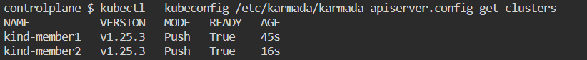

### join member clusters kind-member2 and kind-member3 to host cluster

1. join member clusters kind-member2 and kind-membe to host cluster

   RUN `MEMBER_CLUSTER_NAME=kind-member2`{{exec}}

   RUN `karmadactl --kubeconfig /etc/karmada/karmada-apiserver.config  join ${MEMBER_CLUSTER_NAME} --cluster-kubeconfig=$HOME/.kube/config --cluster-context=kind-member2`{{exec}}

   RUN `MEMBER_CLUSTER_NAME=kind-member3`{{exec}}

   RUN `karmadactl --kubeconfig /etc/karmada/karmada-apiserver.config  join ${MEMBER_CLUSTER_NAME} --cluster-kubeconfig=$HOME/.kube/config --cluster-context=kind-member3`{{exec}}
2. check karmada resources

   RUN `kubectl --kubeconfig /etc/karmada/karmada-apiserver.config get clusters`{{exec}}
3. The following example is output, indicating that the addition was successful

   
